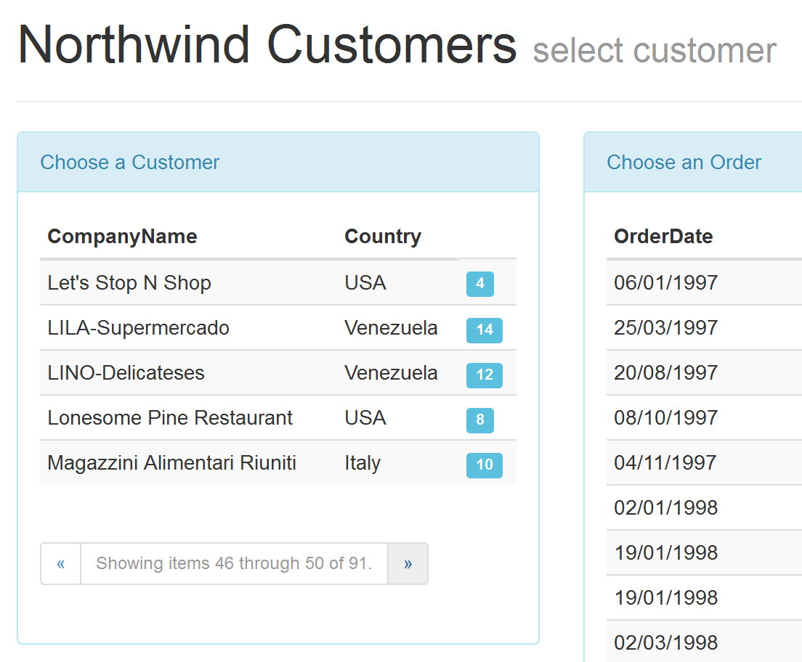

####Northwind Ajax Example

This application queries the Northwind database employing a variety of ajax calls, views and partial views, some jQuery and pagination controls.

The home page displays a panel containing a listing of **Customers**. These are retrieved from the database using a call to a stored procedure imported as a function via entity framework.

The panel is rendered with styling provided by Bootstrap. Additional styling is achieved by adding a &lt;label&gt; control containing the number of **Orders** associated with that **Customer**.

The panel makes maximum use of ajax calls and partial views. On first call, the model is passed to the partial view for rendering. On subsequent ajax calls prompted by the pagination, the action method returns the partial view.

Clicking the row for a **Customer** will display a collection of **Orders** for that **Customer** alongside in another panel. This is achieved by a ajax call in js back to an action method. A partial view is also used to inject the returned data into the panel.